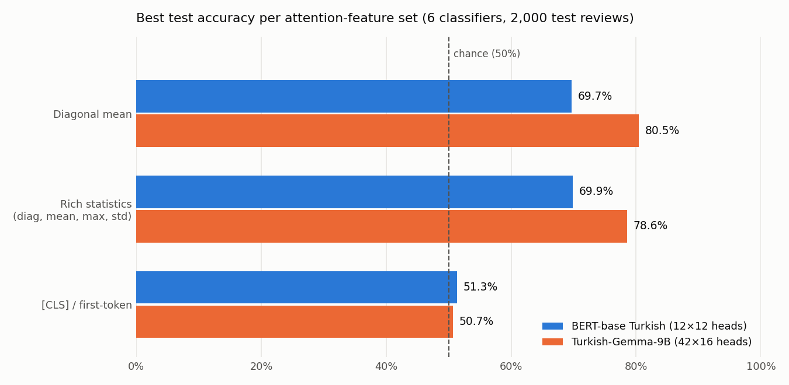
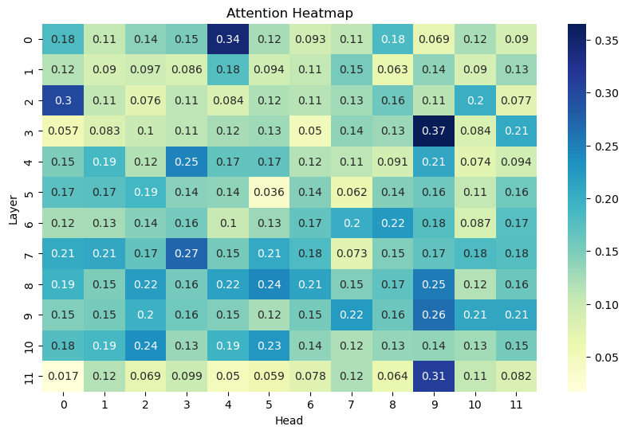

# Attention Matrices as Features for Turkish Sentiment Analysis

Can a language model's **attention patterns alone** tell a positive movie review from a negative one?
This project extracts statistics from the attention heads of **BERT-base Turkish** and **Turkish-Gemma-9B**, uses them as feature vectors, and benchmarks six classifiers on a balanced set of 10,000 Turkish movie reviews.

**Key result:** attention features from Gemma-9B reach **80.5% accuracy**, compared with **69.9%** for BERT. No hidden states or fine-tuning are used.



---

## Approach

```
review ──► tokenizer (≤128 tokens) ──► model(output_attentions=True)
                                            │
                     attention tensor: layers × heads × seq × seq
                                            │
                  per-head statistics  ──►  feature vector  ──►  classifier
```

| Model | Type | Layers × heads |
|---|---|---|
| [`dbmdz/bert-base-turkish-cased`](https://huggingface.co/dbmdz/bert-base-turkish-cased) | Encoder | 12 × 12 |
| [`ytu-ce-cosmos/Turkish-Gemma-9b-v0.1`](https://huggingface.co/ytu-ce-cosmos/Turkish-Gemma-9b-v0.1) | Decoder | 42 × 16 |

| Feature set | Computed per head | Dimensions (BERT / Gemma) |
|---|---|---|
| **Diagonal mean** | mean of the attention diagonal: how strongly tokens attend to themselves | 144 / 672 |
| **Rich statistics** | diagonal mean, overall mean, max, std | 576 / 2,688 |
| **[CLS] / first token** | mean of the first token's attention row | 144 / 672 |

**Classifiers:** Logistic Regression, SVC, KNN, Random Forest, Gradient Boosting, MLP (scikit-learn), 80/20 train/test split.

### Data

[TFLai/turkish_movie_sentiment](https://huggingface.co/datasets/TFLai/turkish_movie_sentiment) contains ~83K reviews scored from 0.5 to 5.0. Preprocessing steps:

- Scores **0.5–2.5 → negative**, **4.0–5.0 → positive**. Ambiguous middle scores are removed.
- Only reviews with ≤ 128 tokens are kept, because attention matrices grow quadratically with length.
- 5,000 reviews are sampled per class, giving **10,000 balanced reviews** (`data/balanced_movie_reviews.csv`).

---

## Results

Test accuracy on 2,000 held-out reviews:

| Model | Feature set | LogReg | SVC | KNN | Random Forest | Grad. Boosting | MLP |
|---|---|---|---|---|---|---|---|
| BERT | Diagonal mean | 64.8 | 66.3 | 57.3 | 63.5 | 63.2 | 69.7 |
| BERT | Rich statistics | 68.3 | 65.9 | 57.2 | **69.9** | 69.1 | 67.0 |
| BERT | [CLS] | 49.4 | 49.6 | 50.0 | 51.3 | 49.6 | 49.4 |
| Gemma-9B | Diagonal mean | 77.5 | 70.3 | 63.7 | 70.6 | 74.0 | **80.5** |
| Gemma-9B | Rich statistics | 78.6 | 49.4 | 63.0 | 72.5 | 75.2 | 65.9 |
| Gemma-9B | First token | 49.4 | 49.4 | 50.7 | 49.4 | 49.4 | 49.4 |

### Findings

- **The larger decoder model encodes much more sentiment signal in its attention.** Gemma beats BERT by about 11 points with the same simple features.
- **Self-attention strength (the diagonal mean) carries most of the signal.** Adding mean, max and std helps BERT, but not Gemma.
- **[CLS] and first-token features fail by design.** Each attention row is a softmax distribution that sums to 1, so its mean is always `1 / seq_len`. With `padding="max_length"` every input has the same length, which makes the feature constant. In a causal model like Gemma, the first token can only attend to itself, so that row is constant as well. Using the *distribution* of the row (for example its entropy or the raw weights) instead of its mean would be a better choice.
- The features were not standardized. This likely explains why the RBF-SVC collapses on the 2,688-dimensional Gemma "rich" set.

<details>
<summary>Example: diagonal-mean value of each BERT head for one review</summary>



</details>

---

## Repository structure

```
├── data/
│   └── balanced_movie_reviews.csv                     # 10K balanced reviews (output of notebook 01)
├── notebooks/
│   ├── 01_data_preprocessing.ipynb                    # relabeling, length filtering, balancing
│   └── 02_attention_features_classification.ipynb     # feature extraction + classification
├── figures/
└── requirements.txt
```

## Getting started

```bash
git clone https://github.com/ezgiieyice/llm-attention-sentiment-analysis.git
cd llm-attention-sentiment-analysis
pip install -r requirements.txt
jupyter notebook notebooks/
```

- BERT feature extraction runs on a CPU in about 30 minutes for 10K reviews, and in a few minutes on a GPU.
- **Gemma-9B needs a GPU with ~20 GB+ VRAM.** Each feature set takes around 30 minutes to extract.
- The extracted `.npy` feature files (up to 215 MB) are not included in the repo. The notebook recreates them.

## Tech stack

Python · PyTorch · Hugging Face Transformers & Datasets · scikit-learn · pandas · NumPy · Matplotlib · Seaborn

---

*Final project for the graduate course **Computational Semantics** at Yıldız Technical University (2025).*
